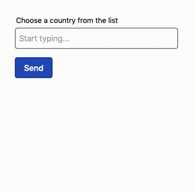

# littleLOOKahead

littleLOOKahead is a small (~2kb) autocomplete or typeahead input, it is built 
using AlpineJS (v3).

## In action


## Usage

littleLOOKahead is fully accessible via the keyboard, just focus and start
typing. After a short delay as it fetches matches from your server the options 
list will pop up with a list of matches. 

Use the down arrow key to access the options list, then use the following keys:

* The '**up**/**down**' arrow keys navigate the list of options
* '**Enter**' selects the highlighted item
* '**Escape**' closes the options list
* '**Tab**' exits the input moving on to the next

## Installation

### Manual installation
Copy the contents of the littleLOOKahead.css file into your project css, then
copy the littleLOOKahead.min.js to the public part of your project and refer to 
it via a script tag.

```html
<script src="/path/to/your/folder/littleLOOKahead.min.js"></script>
```

## Documentation

### Getting started

Create your input using the following boilerplate to get started:

```html
<div class="field is-autocomplete" x-data="littleLOOKahead({url: '/examples/json.php'})">
    <label for="example">Choose a country from the list</label>
    <div class="input-autocomplete">
        <input id="example" name="example" type="text" placeholder="Start typing..." value="" x-ref="input" autocomplete="off">
        <div id="example-input-list" class="input-list" role="combobox list" x-ref="items">
            <template x-for="item in items">
                <div tabindex="0"
                    class="input-list-item"
                    data-id="item.id"
                    data-value="item.value"
                    x-html="item.content"
                    x-bind:class="{'is-selected': value == item.value}"
                    x-on:keydown.stop.prevent="itemKeyPressed(item.value, item.id)"
                    x-on:click="set(item.value)"
                    role="combobox item">
                </div>
            </template>
        </div>
    </div>
</div>
```

You will need to change the `url` to your data endpoint and you may want to set 
the input `value`.

### Fetching data

littleLOOKahead expects a JSON response from your server, the response must be
an array of objects with the following properties:

```json
[
    {
        "id": "your item id",
        "value": "The value that will appear in the input if chosen",
        "content": "An optional string of HTML used to style your list options",
    },
    ...
]
```

**Note:** 
The `id` and `value` properties are required, but the `content` property is optional.
If `content` is not defined the `value` property will be used instead.

## Styling

littleLOOKahead requires a small amount of styling, it is designed to work with
a custom CSS framework. The required CSS styles are attached in the examples.

## A11y

littleLOOKahead aims to be fully accessible, however in it's current state there
is still room for improvement. The control is fully keyboard navigable but has
not been tested in a screenreader. The Firefox accessibility inspector shows 
that improvements can be made and pull requests to do so are welcome.
